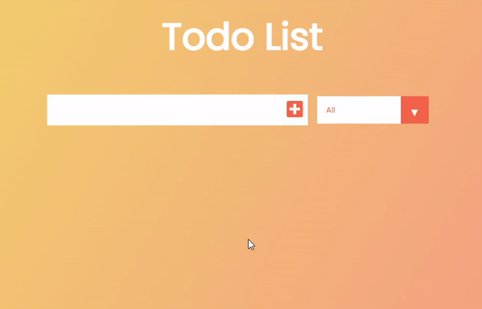

# TodoList
🔎 About: Application made to help you better organize your tasks and improve your productivity.

## ⚔️ 𝐓𝐡𝐞 𝐜𝐡𝐚𝐥𝐥𝐞𝐧𝐠𝐞
Users should be able to:
- [x]  Add a new task
- [x] Complete a task
- [x] Toggle between All, Active and Completed
- [x] Remove one or all tasks on the Completed tab

## ⚙️ 𝐏𝐥𝐮𝐬: 
✔️ Data stored in local storage so when the user refreshes the page or leaves it, the progress still exists.

## 👀 𝗣𝗿𝗲𝘃𝗶𝗲𝘄

## ⚙️ 𝗧𝗲𝗰𝗵𝗻𝗼𝗹𝗼𝗴𝗶𝗲
*   Css
*   Vanilla Js

## Author
- [@Pardis-h](https://github.com/Pardis-h)
